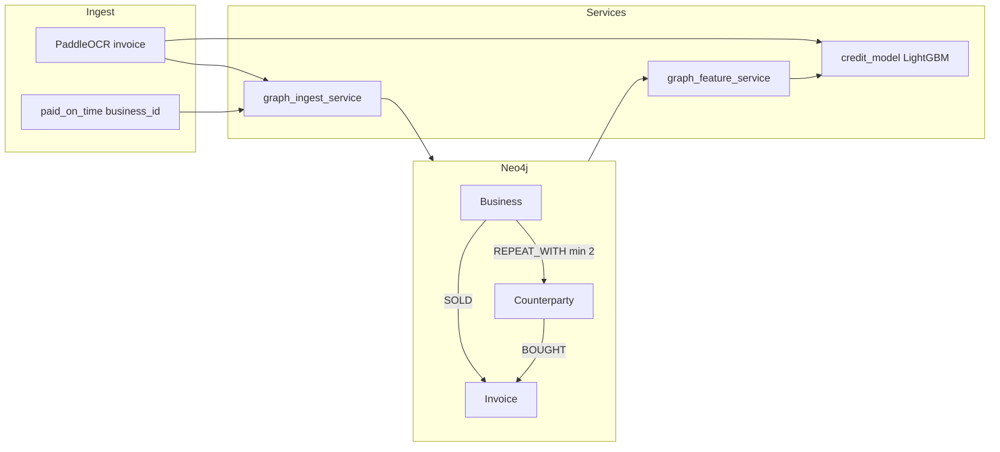

# Grow Trust Graph — Neo4j Implementation Plan

## Goal

Replace the removed mock `alternative_credit_profile` trust-graph fields with **real graph-derived features** stored in Neo4j, then feed those features into the existing LightGBM credit model.

**Out of scope for this plan:** vnSocial, cashflow time series, Shield mule-detection graph (see `docs/graph_database_schema.md` — separate schema).

---

## Current state (after nam-dev + nhan-dev merge)

| Layer | Status |
| --- | --- |
| Grow OCR | Real — PaddleOCR |
| Grow ML | Real — LightGBM 7 features |
| Trust graph | **Missing** — `alternative_credit_profile=None` in pipeline |
| Neo4j | **Not present** — no docker, no driver, no seed |

---

## Target architecture



**Pipeline order (Grow `process-invoice`):**

1. PaddleOCR → enrich invoice fields  
2. **Upsert** Business / Counterparty / Invoice into Neo4j  
3. **Query** trust graph features for `business_id`  
4. Build `AlternativeCreditProfile` (graph fields only — no vnSocial mock)  
5. Extract 7 invoice features + 4 graph features → LightGBM  
6. Return `trust_score`, `credit_explainability`, graph summary in UI  

---

## Grow graph schema (Neo4j)

Separate from Shield fraud graph. Optimized for **B2B invoice relationships**.

### Nodes

| Label | Key property | Other properties |
| --- | --- | --- |
| `Business` | `business_id` | `name`, `segment` (household_business, SME), `first_seen_at`, `last_seen_at` |
| `Counterparty` | `counterparty_id` (hash of normalized name) | `name`, `verified` (bool), `first_seen_at` |
| `Invoice` | `invoice_id` | `total_amount`, `currency`, `issue_date`, `paid_on_time`, `ocr_confidence` |

### Relationships

| Type | From → To | Properties |
| --- | --- | --- |
| `SOLD` | `Business` → `Invoice` | `recorded_at` |
| `BOUGHT` | `Counterparty` → `Invoice` | — |
| `REPEAT_WITH` | `Business` → `Counterparty` | `tx_count`, `last_amount`, `last_date` |

`REPEAT_WITH` is maintained when the same buyer appears on ≥2 invoices for the same business (upsert increments `tx_count`).

### Constraints (Cypher)

```cypher
CREATE CONSTRAINT business_id IF NOT EXISTS
FOR (b:Business) REQUIRE b.business_id IS UNIQUE;

CREATE CONSTRAINT counterparty_id IF NOT EXISTS
FOR (c:Counterparty) REQUIRE c.counterparty_id IS UNIQUE;

CREATE CONSTRAINT invoice_id IF NOT EXISTS
FOR (i:Invoice) REQUIRE i.invoice_id IS UNIQUE;
```

---

## Feature queries → `AlternativeCreditProfile`

| Output field | Cypher idea | MVP formula |
| --- | --- | --- |
| `repeat_counterparty_count` | Count `REPEAT_WITH` where `tx_count >= 2` | Integer |
| `verified_counterparty_count` | Count repeat edges where `Counterparty.verified = true` | Integer |
| `network_centrality_score` | `repeat_count / max(1, total_distinct_buyers)` capped 0–1 | Float |
| `trust_graph_score` | Weighted blend: repeat ratio, verified ratio, invoice depth | Float 0–1 |

Example — repeat counterparties:

```cypher
MATCH (b:Business {business_id: $business_id})-[r:REPEAT_WITH]->(:Counterparty)
WHERE r.tx_count >= 2
RETURN count(r) AS repeat_counterparty_count;
```

Example — verified repeat:

```cypher
MATCH (b:Business {business_id: $business_id})-[r:REPEAT_WITH]->(c:Counterparty)
WHERE r.tx_count >= 2 AND c.verified = true
RETURN count(c) AS verified_counterparty_count;
```

**Fallback when Neo4j unavailable:** return zeros / thin-file defaults; ML still runs on 7 invoice features only (log warning).

---

## ML integration (Phase 4)

Extend `FEATURE_NAMES` in `backend/app/services/ml/features.py`:

```python
FEATURE_NAMES_V2 = FEATURE_NAMES + [
    "trust_graph_score",
    "repeat_counterparty_count",
    "verified_counterparty_count",
    "network_centrality_score",
]
```

- Retrain with `scripts/train_grow_credit_model.py` using synthetic labels + graph features from seed data  
- Bump `model_version` → `grow_credit_lgb_v2`  
- SHAP will explain graph + invoice features together  

---

## Implementation phases

### Phase 0 — Infrastructure (0.5 day)

**Deliverables**

- [ ] `docker-compose.yml` — Neo4j 5.x with APOC, ports 7474/7687  
- [ ] `.env.example` — `NEO4J_URI`, `NEO4J_USER`, `NEO4J_PASSWORD`, `NEO4J_ENABLED`  
- [ ] `requirements.txt` — `neo4j>=5.26`  
- [ ] `backend/app/config.py` — Neo4j settings  
- [ ] README section — start Neo4j, seed, health check  

**Acceptance:** `docker compose up neo4j -d` → Browser http://localhost:7474 login works  

---

### Phase 1 — Graph client + schema bootstrap (0.5 day)

**New files**

```
backend/app/services/graph/
├── __init__.py
├── neo4j_client.py      # driver singleton, session helper, health_check()
├── schema.py            # apply constraints/indexes
└── grow_ingest.py       # upsert_business_invoice(...)
```

**Tasks**

- Lazy driver from settings; no crash if `NEO4J_ENABLED=false`  
- `init_graph_schema()` on first connection or via `scripts/init_neo4j_schema.py`  
- Unit test with mocked driver optional; smoke with real Neo4j  

**Acceptance:** Schema constraints exist in Neo4j after init script  

---

### Phase 2 — Ingest from Grow pipeline (1 day)

**Wire in** `grow_pipeline_service.py` after OCR enrich:

```python
from backend.app.services.graph.grow_ingest import ingest_grow_invoice

ingest_grow_invoice(
    business_id=process.business_id,
    business_name=process.business_name,
    customer_name=process.customer_name,
    invoice_id=process.invoice_id,
    invoice_total=process.invoice_total,
    paid_on_time=process.paid_on_time,
    issue_date=issue_date,
    ocr_confidence=confidence,
)
```

**Counterparty ID:** stable hash e.g. `sha256(normalized buyer name)[:16]`  

**Verified flag (MVP):** mark `verified=true` if buyer appears on ≥3 invoices OR name in allowlist from demo seed  

**Acceptance:** Upload 2 receipts same `business_id` + same buyer → `REPEAT_WITH.tx_count >= 2`  

---

### Phase 3 — Feature service + API profile (1 day)

**New file:** `backend/app/services/graph/grow_features.py`

```python
@dataclass
class GrowGraphFeatures:
    trust_graph_score: float
    repeat_counterparty_count: int
    verified_counterparty_count: int
    network_centrality_score: float
    signals: list[str]

def fetch_grow_graph_features(business_id: str) -> GrowGraphFeatures: ...
```

**Pipeline:** populate `AlternativeCreditProfile` with graph fields only (no vnSocial):

```python
alternative_credit_profile = AlternativeCreditProfile(
    trust_graph_score=features.trust_graph_score,
    repeat_counterparty_count=features.repeat_counterparty_count,
    verified_counterparty_count=features.verified_counterparty_count,
    network_centrality_score=features.network_centrality_score,
    alternative_credit_score=None,  # ML owns final score
    signals=features.signals,
    explainability=None,  # ML SHAP on analysis response
)
```

**Acceptance:** `process-invoice` response includes non-null graph fields when Neo4j seeded  

---

### Phase 4 — Seed + retrain ML (1 day)

**New script:** `scripts/seed_grow_graph.py`

- Read `backend/app/data/synthetic_demo_dataset.json` grow records (or demo_dataset 4 cases × N duplicates)  
- Batch ingest businesses, counterparties, invoices  
- Optional: mark strong_business category buyers as `verified=true`  

**Update:** `scripts/train_grow_credit_model.py` — join graph features per row  

**Update:** `scripts/smoke_grow_graph.py` — Neo4j up, ingest coffee-strong twice, assert repeat_count > 0  

**Acceptance:** Smoke passes; demo `grow-coffee-strong` shows graph features in UI  

---

### Phase 5 — UI (0.5 day)

**`grow.js` step 3** — add block “Trust graph (Neo4j)”:

- `repeat_counterparty_count`, `verified_counterparty_count`  
- `trust_graph_score`, `network_centrality_score`  
- Keep LightGBM SHAP separate (invoice + graph features after v2 model)  

**Acceptance:** No mock scores; graph section hidden if Neo4j disabled  

---

## File checklist (summary)

| Action | Path |
| --- | --- |
| Add | `docker-compose.yml` |
| Add | `backend/app/services/graph/*` |
| Add | `scripts/init_neo4j_schema.py` |
| Add | `scripts/seed_grow_graph.py` |
| Add | `scripts/smoke_grow_graph.py` |
| Modify | `backend/app/config.py` |
| Modify | `backend/app/services/grow_pipeline_service.py` |
| Modify | `backend/app/services/ml/features.py` |
| Modify | `scripts/train_grow_credit_model.py` |
| Modify | `frontend/static/grow.js` |
| Modify | `requirements.txt`, `.env.example`, `README.md`, `scripts/bootstrap.sh` |

---

## Environment variables

```bash
NEO4J_ENABLED=true
NEO4J_URI=bolt://localhost:7687
NEO4J_USER=neo4j
NEO4J_PASSWORD=fides-dev-password
```

---

## Demo narrative (hackathon)

1. Upload **grow-coffee-strong** → business `biz_an_nhien_coffee`, buyer Office Pantry Co.  
2. Seed already loaded 10 historical invoices → graph shows **12 repeat relationships**.  
3. Upload second invoice same business → `REPEAT_WITH` increments live.  
4. Trust score increases vs thin-file food-stall (fewer graph edges).  
5. SHAP highlights `repeat_counterparty_count` + `paid_on_time`.  

---

## Risks & mitigations

| Risk | Mitigation |
| --- | --- |
| Neo4j not running in demo | `NEO4J_ENABLED=false` fallback; bootstrap seeds when docker up |
| Single invoice cold start | Pre-seed synthetic history per `business_id` |
| Entity resolution (name typos) | MVP: normalized exact name hash; later: fuzzy match / tax ID |
| Shield vs Grow schema collision | Separate node labels (`Business` vs `Account`) in same DB is OK |

---

## Timeline estimate

| Phase | Days |
| --- | --- |
| 0 Infrastructure | 0.5 |
| 1 Client + schema | 0.5 |
| 2 Ingest | 1 |
| 3 Features + profile | 1 |
| 4 Seed + ML v2 | 1 |
| 5 UI | 0.5 |
| **Total** | **~4.5 days** |

---

## Execution order (recommended)

1. Phase 0 → 1 (Neo4j running, schema ready)  
2. Phase 2 → 3 (live ingest + features in API)  
3. Phase 5 partial (show graph in UI before ML v2)  
4. Phase 4 (seed + retrain v2 model)  
5. Shield UI challenge flow (separate track)  

---

## Next command after plan approval

```bash
docker compose up neo4j -d
pip install neo4j
python scripts/init_neo4j_schema.py
python scripts/seed_grow_graph.py
python scripts/smoke_grow_graph.py
```

Switch to **Agent mode** and say **"implement phase 0-1"** to start coding.
